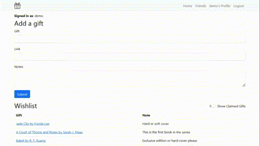

# Gift List
A simple gift registry app to track birthday and holiday presents between family and friends. 

**Website:** http://giftlist.cyclic.app
Demo Credentials: demo@demo.com demo1234

## Introduction

Client had been using a custom google sheet to track family gift lists but was looking for a better solution since there had been multiple mistakes. 

End users are 18-65+ years olds with various levels of experience using technology. 

## Features

    -   Minimalistic styling and simple interface for varying levels of tech literacy
    -   User profile creation
    -   Private friending, only people with your link can add you
    -   Add friends to your friend list
    -   Add gifts to your own gift list so others can claim
    -   Add notes to your gifts to clarify details
    -   Delete gifts from your own gift list if you change your mind
    -   Show user if gift is already claimed before deleting
    -   Hide gift claimed status for user so surprise isnt ruined
    -   Friend list to easily navigate to friends' pages
    -   Keep track of friends' birthdays
    -   Claim and unclaim gifts from friends lists

## How It's Made:

**Tech used:** Express, MongoDB, Mongoose, Bootstrap, Passport, NodeJS, EJS, JavaScript, HTML, CSS  

## Optimizations

    - Separate gift lists for different holidays/events
    - A way to add friends in app
    - Pictures on wishlist
    - Individual avatars
    - Explore/discover page
    - Password recovery
    - Redirect after signin to previous page
